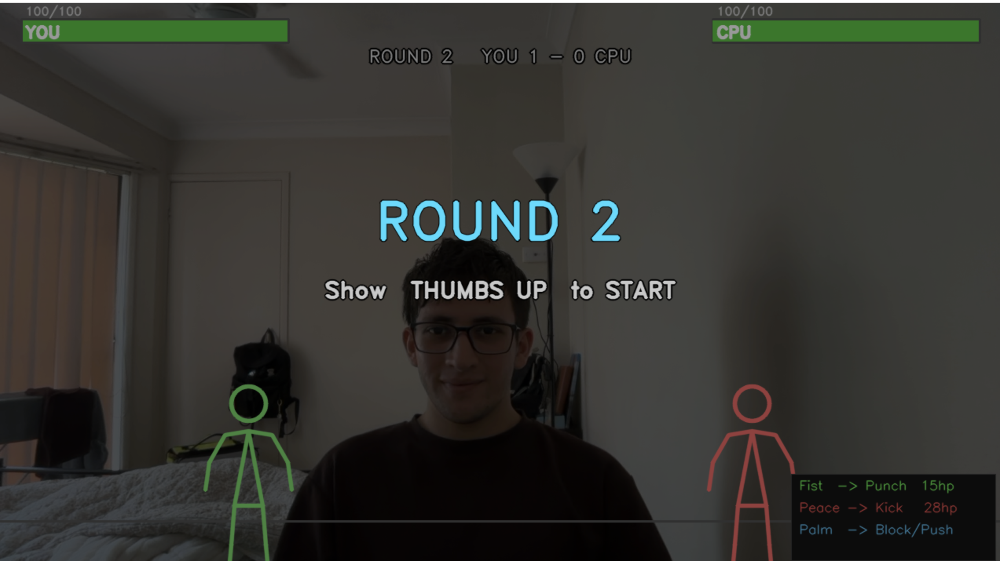
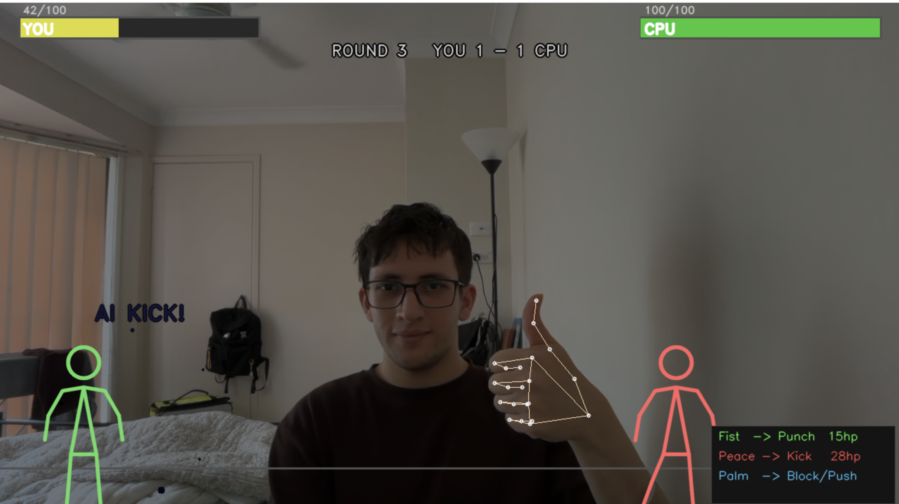
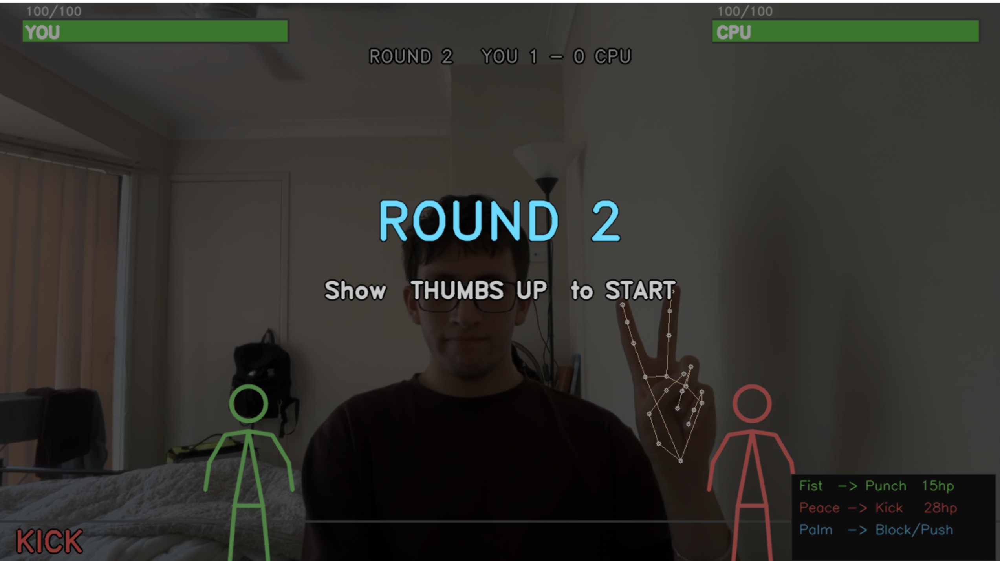

# Gesture AR — Stickman Fight

> A real-time hand gesture fighting game that runs on your webcam. No controllers. No keyboard. Just your hands.



---

## How It Works

MediaPipe detects 21 landmark points on your hand every frame. The game reads the configuration of those landmarks to recognise your gesture, then triggers animations and combat logic in real time — all at ~30fps on a standard webcam.

---

## Gameplay

Show 👍 **Thumbs Up** to start a round. Then fight using three hand gestures:

| Gesture | Move | Damage |
|---|---|---|
| ✊ Closed Fist | Punch | 15 HP |
| ✌️ Peace Sign | Kick | 28 HP |
| 🖐 Open Palm | Block / Push | Blocks punch & fist — kick breaks through |

- **Best of 3 rounds** — first to win 2 rounds wins the match
- **AI difficulty scales** each round — it gets faster
- **Screen shake, hit particles, knockback** on every strike
- Show 👍 **Thumbs Up** again after game over to replay

---

## Screenshots

| Starting Screen | Lost | Victory |
|---|---|---|
|  |  |  |


---

## Setup

**Requirements**
- Python 3.8+
- Webcam

**Install dependencies**
```bash
pip install opencv-python mediapipe==0.10.13 numpy
```

**Run**
```bash
python main.py
```

Press `Q` to quit at any time.

---

## Tech Stack

| Tool | Purpose |
|---|---|
| [MediaPipe](https://mediapipe.dev) | Real-time hand landmark detection |
| [OpenCV](https://opencv.org) | Webcam capture and frame rendering |
| NumPy | Matrix operations and frame manipulation |
| Python | Game loop, physics, AI, combat logic |

---

## Project Structure

```
gesture-ar/
├── main.py          # Everything — detection, stickman, AI, game loop
├── README.md
└── screenshots/     # Add your screenshots here
```

---

## Features

- **Gesture stabiliser** — gesture must be held for 6 frames before registering, eliminating false triggers
- **Smooth stickman animation** — all pose transitions use linear interpolation so movement feels fluid
- **Physics** — knockback with friction, gravity on hit particles, screen shake decay
- **Block mechanic** — palm blocks fist/punch but kick breaks through, adding a rock-paper-scissors layer
- **Scalable AI** — opponent attack frequency increases each round

---

## Author

Built by **Ashmit Raina** · [GitHub](https://github.com/ashmitraina)

---

<p align="center">Made with Python, MediaPipe, and way too much fun</p>